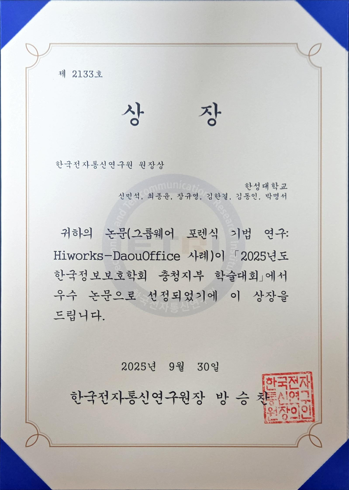
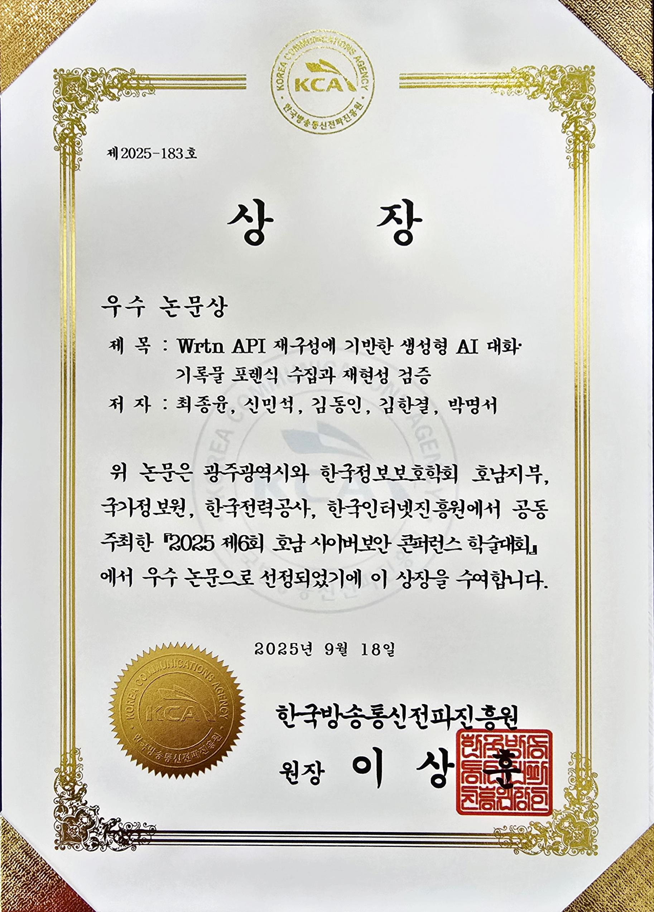
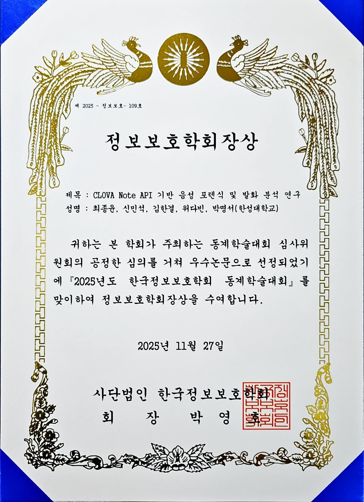
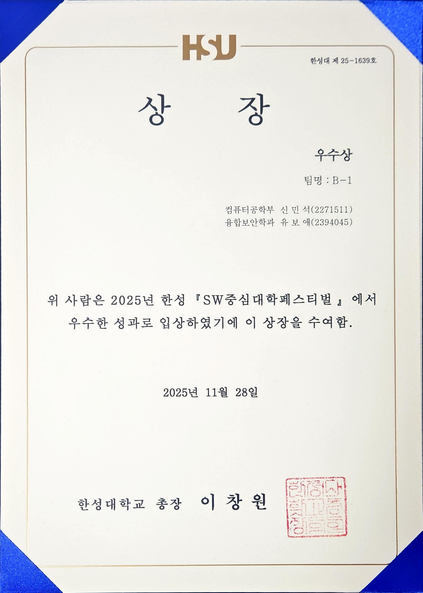
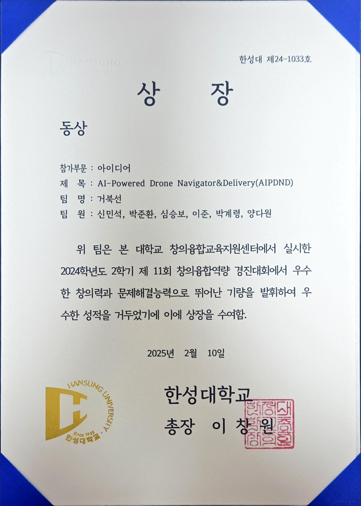

# 🧑‍🎓✨ Hi, I'm Minseok Shin (신민석)

Graduate student & Digital Forensics / Security Researcher  
Hansung University, Korea  

---

## 🏆 Honors & Awards

> All awards below are official certificates from academic conferences and university competitions.  
> Awards are listed in descending order by **academic prestige**:  
> **External conferences first → First-author papers first → Higher-level awards first.**  
> When my name (신민석) appears first, I am the **First Author / Lead Contributor**.

---

## 🌐 External Conferences & Academic Societies

### 🥇 1. 한국전자통신연구원(ETRI) 원장상

**학회:** 2025 한국정보보호학회 충청지부 학술대회 (CISC-S 2025)  
**논문 제목:** 그룹웨어 포렌식 기법 연구: Hiworks–DaouOffice 사례  
**저자:** **신민석(주저자, First Author)**, 최종윤, 장규영, 김한결, 김동인, 박명서  
**수상일:** 2025-09-30  

 

---

### 🥇 2. 우수논문상 (호남지부)

**학회:** 2025 제6회 호남사이버보안 컨퍼런스 추계학술대회 (HONAM 2025)  
**논문 제목:** 생성형 AI 기반 Perplexity 대화 데이터 획득 방안 연구  
**저자:** **신민석(주저자, First Author)**, 최종윤, 김한결, 위다빈, 박명서  
**수상일:** 2025-09-18  

 

---

### 🥈 3. 은상 (한국포렌식학회 논문경진대회)

**학회:** 2025 제2회 한국포렌식학회 논문경진대회  
**논문 제목:** 조직 내부 데이터 압수 수색을 위한 그룹웨어 포렌식 기술 연구: DaouOffice를 중심으로  
**저자:** **신민석(주저자, First Author)**  
**수상일:** 2025-09-23  

 

---

### 🥇 4. 우수논문상 (한국방송통신전파진흥원장상)

**학회:** 2025 제6회 호남 사이버보안 컨퍼런스 (HONAM 2025)  
**논문 제목:** Wrtn API 재구성에 기반한 생성형 AI 대화 기록물 포렌식 수집과 재현성 검증  
**저자:** 최종윤, **신민석(제2저자)**, 김동인, 김한결, 박명서  
**수상일:** 2025-09-18  

 

---

### 🥇 5. 정보보호학회장상 (우수논문)

**학회:** 2025년도 한국정보보호학회 동계학술대회 (CISC-W 2025)  
**논문 제목:** CLOVA Note API 기반 음성 포렌식 및 발화 분석 연구  
**저자:** 최종윤, **신민석(제2저자)**, 김한결, 위다빈, 박명서  
**수상일:** 2025-11-27  

 

---

## 🏫 Hansung University & Internal Competitions

### 🥇 6. 최우수상 (논문)

**대회:** 제21회 한성공학경진대회  
**논문 제목:** 기술 유출 및 겸직·겹업 위반 대응을 위한 Hiworks 협업 도구 로그 분석 자동화 툴 개발  
**역할:** **신민석 (주저자, First Author)**  
**수상일:** 2025-09-26  

 

---

### 🥇 7. 대상

**대회:** 2025 창의융합역량 경진대회  
**분야:** 아이디어  
**작품 제목:** 생체 인식 기반 미래형 AI–블록체인 응급환자 골든타임 확보 시스템  
**팀명:** 메디슨  
**역할:** **신민석**  
**수상일:** 2025-08-13  

 

---

### 🥈 8. 우수상

**행사:** 2025 한성 SW중심대학 페스티벌  
**팀명:** B-1  
**역할:** 신민석, 유보애  
**수상일:** 2025-11-28  

 

---

### 🥉 9. 동상

**대회:** 2024학년도 2학기 제11회 창의융합역량 경진대회  
**작품 제목:** AI-Powered Drone Navigator & Delivery (AIPDND)  
**팀명:** 거북선  
**팀원:** **신민석**, 박준환, 심승보, 이준, 박계령, 양다원  
**수상일:** 2025-02-10  

 

---

## 📄 Publications

### 🔹 암호화폐 기반 랜섬 머니 지급 흐름과 추적 기술 동향  
- **Authors**: 최종윤, **신민석 (2nd author)**, 박화비, 한동균, 신준성, 박명서  
- **Journal**: 정보보호학회지  
- **Volume / Issue**: Vol.35, No.6  
- **Pages**: 41–48  
- **Published**: 2025-12  
- **Affiliation**: Hansung University  
- **Link**: https://www.dbpia.co.kr/

> Note: In this paper, I am the **second author**.  
> First authorship is explicitly indicated only when my name appears first.

---
## 🎤 Conference Presentations (2025)

> All entries below are **official peer-reviewed conference presentations** in 2025.  
> Authorship order strictly follows the submission system records.  
> **First Author (주저자)** is explicitly marked only when my name appears first.

---

### 🔹 CISC-S 2025  
*Korean Institute of Information Security & Cryptology – Chungcheong Branch*

1. **겸직·겹업 위반 대응을 위한 Hiworks 협업 도구 로그 분석 자동화 툴 개발**  
   - **Authors:** **신민석 (First Author)**, 위다빈, 박명서  

2. **폴라리스 오피스 대상의 클라우드 포렌식 기술 연구**  
   - **Authors:** 위다빈, 김한결, 안원석, **신민석**, 박명서  

---

### 🔹 HONAM 2025  
*6th Honam Cyber Security Conference*

1. **생성형 AI 기반 Perplexity 대화 데이터 획득 방안 연구**  
   - **Authors:** **신민석 (First Author)**, 최종윤, 김한결, 위다빈, 박명서  

2. **Wrtn API 재구성에 기반한 생성형 AI 대화·기록물 포렌식 수집과 재현성 검증**  
   - **Authors:** 최종윤, **신민석**, 김동인, 김한결, 박명서

---

### 🔹 HONAM 2025  
*6th Honam Cyber Security Conference*

1. **생성형 AI 기반 Perplexity 대화 데이터 획득 방안 연구**  
   - **Authors:** **신민석 (First Author)**, 최종윤, 김한결, 위다빈, 박명서  

2. **Wrtn API 재구성에 기반한 생성형 AI 대화·기록물 포렌식 수집과 재현성 검증**  
   - **Authors:** 최종윤, **신민석**, 김동인, 김한결, 박명서  

---

### 🔹 KIISCCC 2025  
*Korea Institute of Information Security & Cryptology – Central Conference*

1. **그룹웨어 포렌식 기법 연구: Hiworks·DaouOffice 사례**  
   - **Authors:** **신민석 (First Author)**, 최종윤, 장규영, 김한결, 김동인, 박명서   

---

### 🔹 CISC-W 2025  
*Korean Institute of Information Security & Cryptology – Winter Conference*

1. **오픈소스 기반 Yurei 랜섬웨어에 대한 동적 분석 및 연관성 식별 연구**  
   - **Authors:** 김한결, 위다빈, 최종윤, **신민석**, 박명서  

2. **차량용 인포테인먼트 기반 사용자 행위 추적**  
   - **Authors:** 김대환, **신민석**, 장규영, 안원석, 박명서  

3. **CLOVA Note API 기반 음성 포렌식 및 발화 분석 연구**  
   - **Authors:** 최종윤, **신민석**, 김한결, 위다빈, 박명서
  
---
## 📫 Contact

- Email: your_email@example.com  
- Research Interests:  
  - Digital Forensics  
  - Mobile App Forensics  
  - Cloud & Groupware Forensics  
  - AI-generated Data Forensics  
