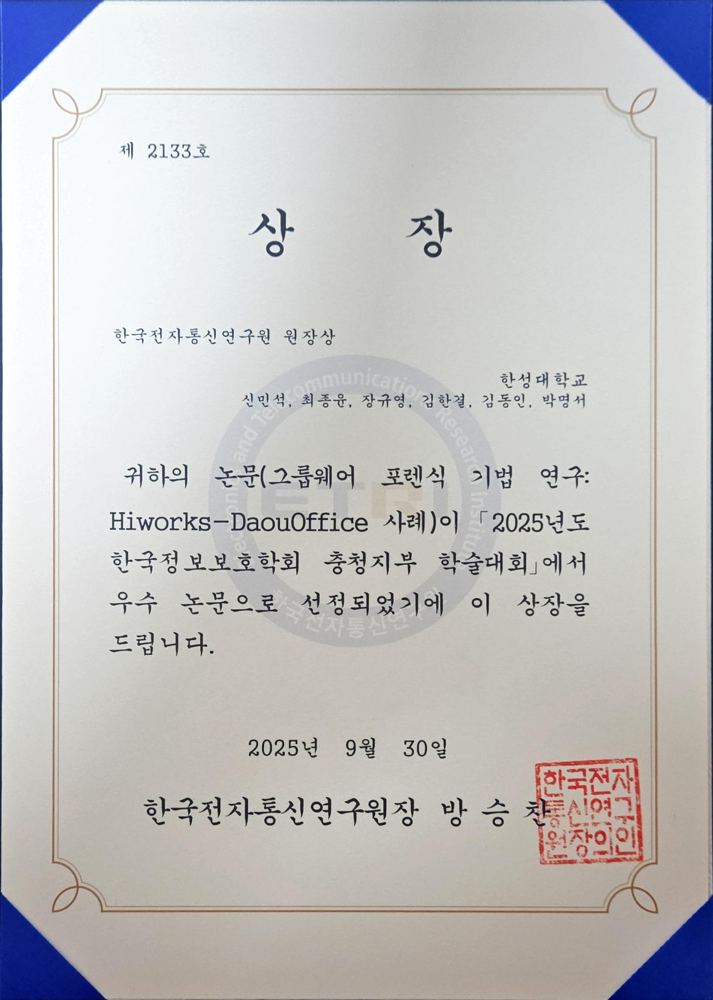
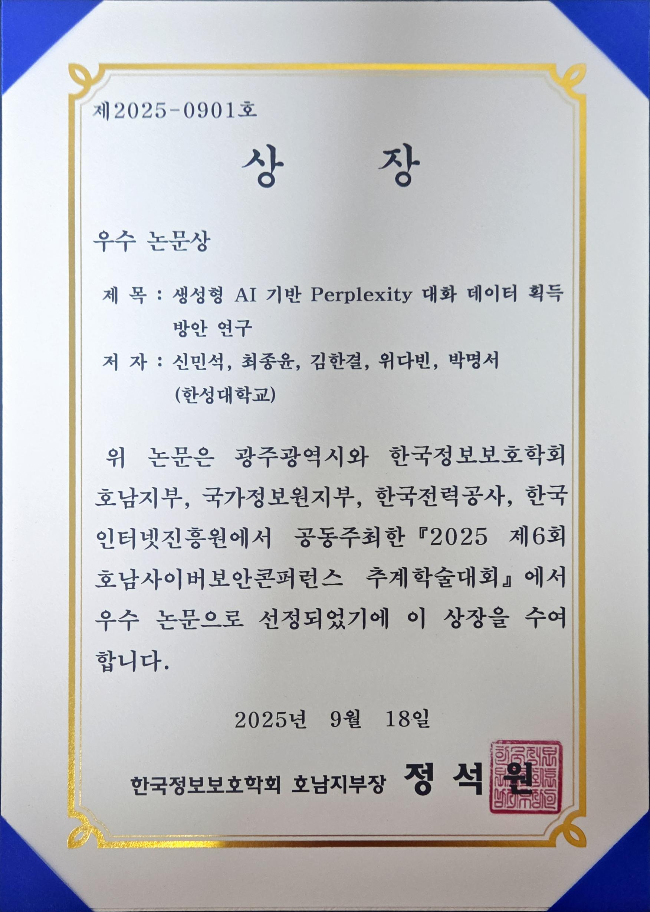
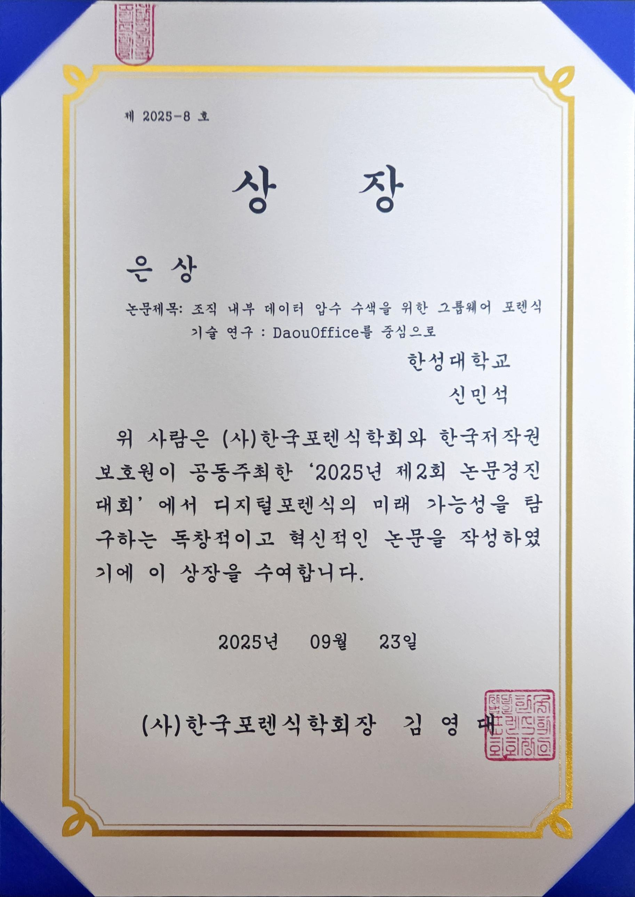
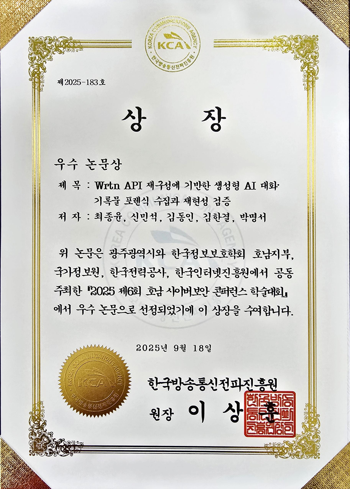
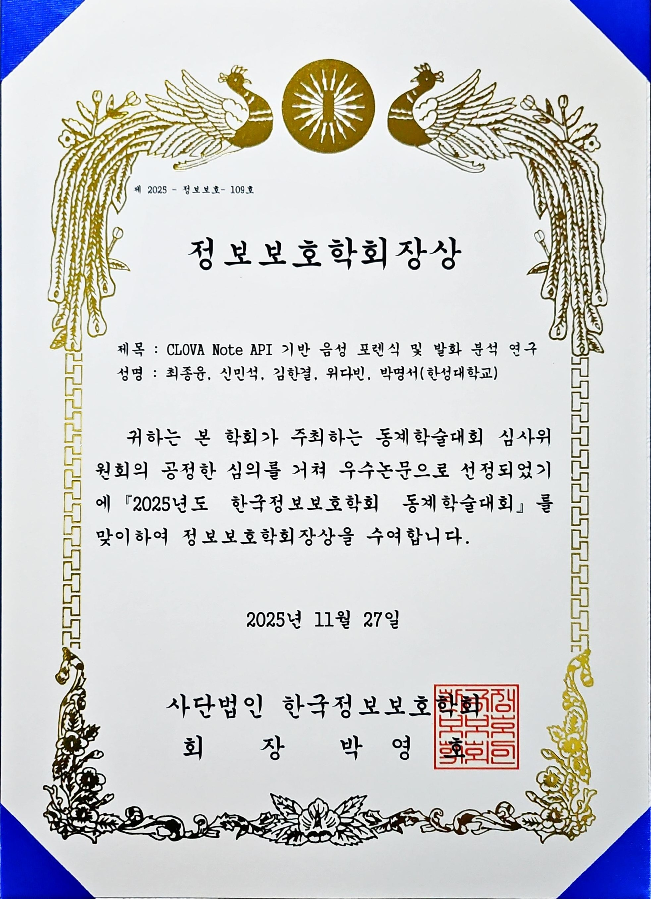
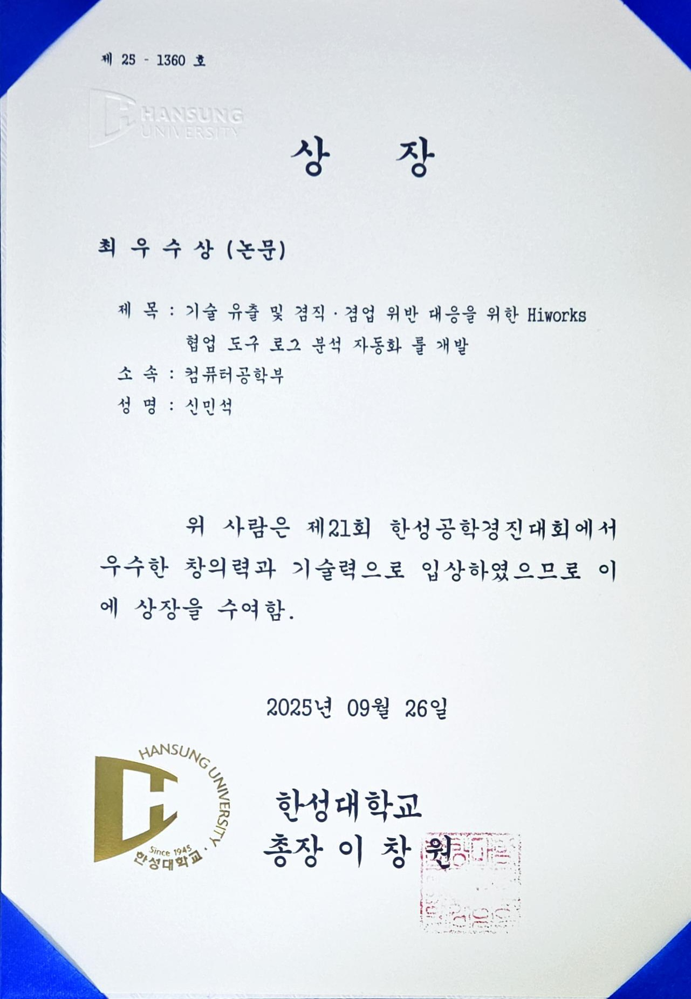
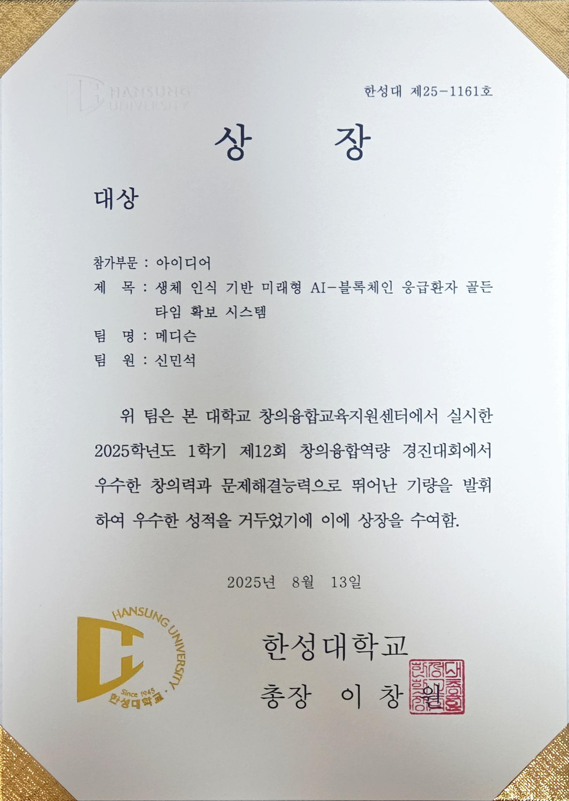
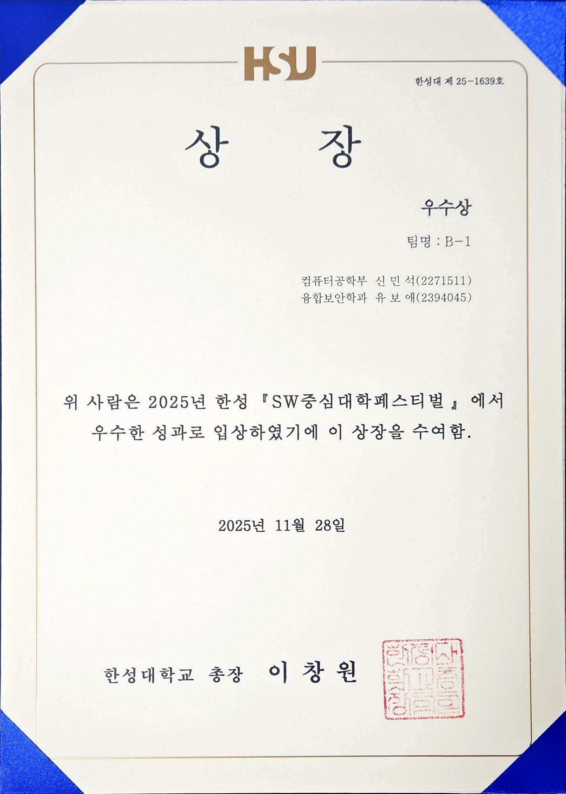
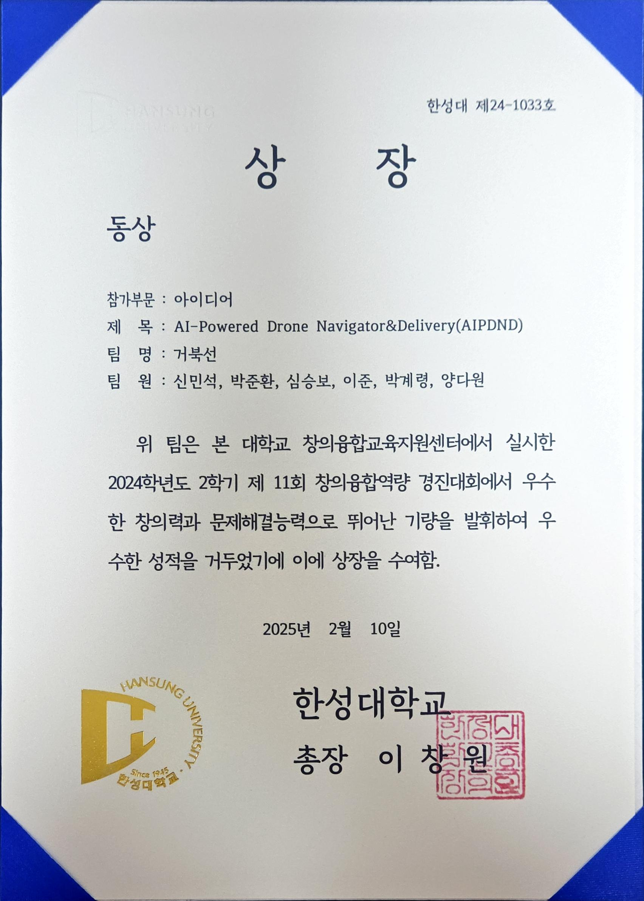

# 🧑‍🎓 신민석 | Minseok Shin

**한성대학교 학사 과정**  
한성대학교 컴퓨터공학부 · 융합보안학과  

---

## 🧩 Profile

안녕하세요. 한성대학교 융합보안학과에 재학 중인 신민석입니다.

저는 **디지털 포렌식, 클라우드 포렌식, 애플리케이션 분석, 리버스 엔지니어링, 랜섬웨어 분석, 보안 자동화** 분야에 관심을 가지고 공부하고 있습니다.

학부 과정 동안 드론 조종기 포렌식, 정보은닉 애플리케이션 암호해제, 클라우드 환경 데이터 획득 및 분석, macOS 통합 로그 분석, 애플리케이션 네트워크 취약점 자동 탐지 등 다양한 연구과제에 참여하였습니다.

이러한 경험을 바탕으로 단순한 이론 학습을 넘어 실제 환경에서 발생하는 보안 문제를 분석하고, 디지털 증거를 수집·검증하며, 포렌식 분석 절차를 자동화하는 역량을 키워가고 있습니다.

---

## 🔬 연구과제 참여 이력

### 🔹 드론 조종기 포렌식 기술 연구 및 분석 방법론 개발

- **연구과제명:** 드론 조종기 포렌식 기술 연구 및 분석 방법론 개발
- **수행기관:** 한국원자력연구원
- **분야:** 디지털 포렌식 / 드론 포렌식

드론 조종기 및 관련 장치에서 발생할 수 있는 디지털 증거를 분석하고, 사용자 행위 흔적과 장치 사용 기록을 식별하기 위한 포렌식 분석 방법론 개발에 참여하였습니다.

---

### 🔹 정보은닉 앱 암호해제 기술 연구개발

- **연구과제명:** 정보은닉 앱 암호해제 기술 연구개발
- **수행기관:** 경찰청
- **분야:** 애플리케이션 포렌식 / 암호화 데이터 분석

정보은닉 애플리케이션 내부에 저장된 암호화 데이터의 구조를 분석하고, 앱 내부 저장 방식과 암·복호화 로직을 파악하여 포렌식 관점에서 데이터 복원 가능성을 검토하는 연구에 참여하였습니다.

---

### 🔹 클라우드 환경의 데이터 획득 및 분석 기술 연구 및 절차 검토

- **연구과제명:** 클라우드 환경의 데이터 획득 및 분석 기술 연구 및 절차 검토
- **수행기관:** 대검찰청
- **분야:** 클라우드 포렌식 / 데이터 획득 및 분석

클라우드 환경에서 데이터를 획득하고 분석하기 위한 기술과 절차를 검토하였으며, 수사 및 포렌식 관점에서 데이터 획득의 신뢰성, 선별 수집 가능성, 분석 절차의 적용 가능성을 연구하였습니다.

---

### 🔹 macOS 환경에서 통합 로그 데이터 분석기법 연구

- **연구과제명:** macOS 환경에서 통합 로그 데이터(ULD) 분석기법 연구
- **수행기관:** 대검찰청
- **분야:** macOS 포렌식 / 통합 로그 분석

macOS 환경에서 생성되는 통합 로그 데이터를 분석하여 사용자 행위, 시스템 동작, 애플리케이션 실행 흔적, 보안 이벤트 등을 식별하기 위한 분석기법 연구에 참여하였습니다.

---

### 🔹 애플리케이션의 네트워크 취약점 자동 탐지 기술 개발에 관한 연구

- **연구과제명:** 어플리케이션의 네트워크 취약점 자동 탐지 기술 개발에 관한 연구
- **수행기관:** 한국연구재단
- **분야:** 애플리케이션 보안 / 네트워크 취약점 분석

애플리케이션의 네트워크 통신 과정에서 발생할 수 있는 보안 취약점을 자동으로 탐지하기 위한 기술 개발 연구에 참여하였습니다. 네트워크 요청 구조, 통신 흐름, 취약 가능 지점 등을 분석하여 자동화된 취약점 탐지 방향을 검토하였습니다.

---

## 🧩 활동

### 🔹 DEAT · 디지털 포렌식 동아리

**DEAT**는 한성대학교 정보보안 분야 동아리로, **디지털 포렌식, 리버스 엔지니어링, 악성코드 분석, 랜섬웨어 분석, 애플리케이션 분석, 보안 연구**를 중심으로 실습 기반 학습과 연구 활동을 수행하는 동아리입니다.

- **회장** — 2026년 1학기
- **부회장** — 2025년 2학기

동아리 운영진으로 활동하며 보안 분야에 관심 있는 학생들이 실무 중심의 분석 경험을 쌓을 수 있도록 스터디, 실습 과제, 프로젝트 활동, 학술대회 참여 등을 기획하고 지원하고 있습니다.

### 주요 활동 분야

- 애플리케이션 분석
- 악성코드 분석
- 랜섬웨어 분석
- 디지털 포렌식 연구
- 리버스 엔지니어링
- 보안 연구 및 학술대회 참여

### 역할

- 동아리 운영 및 활동 기획
- 보안 실습 과제 구성
- 동아리원 학습 방향 지원
- 디지털 포렌식 및 악성코드 분석 관련 스터디 운영
- 학술대회 및 연구 활동 참여 독려

---

## 🏆 수상 이력

> 아래 수상 내역은 학술대회 및 교내 경진대회 상장 기준으로 작성되었습니다.

---

## 🌐 외부 학술대회 및 학회 수상

### 🥇 1. 한국전자통신연구원장상

**학술대회:** 2025 한국정보보호학회 충청지부 학술대회 
**논문명:** 그룹웨어 포렌식 기법 연구: Hiworks–DaouOffice 사례 
**저자:** **신민석**, 최종윤, 장규영, 김한결, 김동인, 박명서 
**역할:** 주저자 
**수상 내용:** Hiworks와 DaouOffice 협업 도구를 대상으로 그룹웨어 환경에서 생성되는 사용자 행위 로그, 업무 데이터, 접속 기록 등 주요 포렌식 아티팩트를 분석하고, 조직 내부 데이터 조사 및 압수수색 상황에서 활용 가능한 포렌식 분석 기법을 제시한 연구로 수상하였습니다. 
**수상일:** 2025-09-30 

 

---

### 🥇 2. 우수논문상

**학술대회:** 2025 제6회 호남사이버보안 컨퍼런스 추계학술대회 
**논문명:** 생성형 AI 기반 Perplexity 대화 데이터 획득 방안 연구 
**저자:** **신민석**, 최종윤, 김한결, 위다빈, 박명서 
**역할:** 주저자 
**수상 내용:** 생성형 AI 서비스인 Perplexity에서 사용자의 대화 데이터와 관련 기록을 포렌식 관점에서 획득하기 위한 방법을 연구하였으며, 웹 서비스 기반 AI 대화 기록의 수집 가능성과 분석 절차를 제시한 점을 인정받아 수상하였습니다. 
**수상일:** 2025-09-18 

 

---

### 🥈 3. 은상 / 한국포렌식학회장상

**대회:** 2025 제2회 한국포렌식학회 논문경진대회 
**논문명:** 조직 내부 데이터 압수수색을 위한 그룹웨어 포렌식 기술 연구: DaouOffice를 중심으로 
**저자:** **신민석**, 김동인, 장규영, 최종윤, 박명서 
**역할:** 주저자 
**수상 내용:** DaouOffice를 중심으로 조직 내부 협업 환경에서 발생하는 업무 데이터, 사용자 활동 기록, 접속 흔적 등을 분석하고, 수사 및 압수수색 과정에서 필요한 그룹웨어 포렌식 데이터 식별 및 수집 방안을 제시한 연구로 은상을 수상하였습니다. 
**수상일:** 2025-09-23 

 

---

### 🥇 4. 우수논문상 / 한국방송통신전파진흥원장상

**학술대회:** 2025 제6회 호남사이버보안 컨퍼런스 
**논문명:** Wrtn API 재구성에 기반한 생성형 AI 대화 기록물 포렌식 수집과 재현성 검증 
**저자:** 최종윤, **신민석**, 김동인, 김한결, 박명서 
**역할:** 공동저자 
**수상 내용:** 생성형 AI 서비스 Wrtn의 API 요청 구조를 분석하고 재구성하여 AI 대화 기록물을 포렌식 관점에서 수집하는 방법을 제시하였으며, 수집 결과의 재현성 검증을 통해 디지털 증거로서의 활용 가능성을 다룬 연구로 수상하였습니다. 
**수상일:** 2025-09-18 

 

---

### 🥇 5. 우수논문상 / 정보보호학회장상

**학술대회:** 2025년도 한국정보보호학회 동계학술대회 
**논문명:** CLOVA Note API 기반 음성 포렌식 및 발화 분석 연구 
**저자:** 최종윤, **신민석**, 김한결, 위다빈, 박명서 
**역할:** 공동저자 
**수상 내용:** CLOVA Note 서비스의 API 기반 데이터 구조를 분석하여 음성 기록과 발화 데이터를 포렌식 관점에서 수집·분석하는 방안을 연구하였으며, 음성 기반 서비스에서의 발화 재구성 및 증거 활용 가능성을 제시한 연구로 수상하였습니다. 
**수상일:** 2025-11-27 

 

---

## 🏫 교내 수상

### 🥇 6. 최우수상 / 논문 부문

**대회:** 제21회 한성공학경진대회 
**논문명:** 기술 유출 및 겸직·겹업 위반 대응을 위한 Hiworks 협업 도구 로그 분석 자동화 툴 개발 
**팀원:** **신민석**, 김대환 
**역할:** 팀장 
**수상 내용:** Hiworks 협업 도구에서 생성되는 로그와 사용자 행위 데이터를 분석하여 기술 유출, 겸직·겹업 위반 등 조직 내부 보안 이슈에 대응할 수 있는 로그 분석 자동화 도구를 개발하였으며, 포렌식 분석 절차의 자동화 가능성을 제시한 성과로 최우수상을 수상하였습니다. 
**수상일:** 2025-09-26 

 

---

### 🥇 7. 대상 / 아이디어 부문

**대회:** 2025 창의융합역량 경진대회 
**프로젝트:** 생체 인식 기반 미래형 AI–블록체인 응급환자 골든타임 확보 시스템 
**팀명:** 메디슨 
**팀원:** 김건우, **신민석**, 양다원, 정윤녕, 조수빈 
**역할:** 팀원 
**수상 내용:** 응급환자 발생 시 생체 인식, AI 분석, 블록체인 기반 신뢰성 확보 기술을 결합하여 환자 식별과 응급 정보 전달을 지원하는 아이디어를 제안하였으며, 응급의료 환경에서 골든타임 확보 가능성을 제시한 점을 인정받아 대상을 수상하였습니다. 
**수상일:** 2025-08-13 

 

---

### 🥈 8. 우수상

**대회:** 2025 한성 SW중심대학 페스티벌 
**팀명:** B-1 
**팀원:** **신민석**, 유보애 
**역할:** 팀장 
**수상 내용:** Google Gemini와 같은 생성형 AI 서비스 이용 과정에서 개인정보와 민감정보가 외부 API로 직접 전달될 수 있는 문제를 해결하기 위해, 프록시 서버 기반의 개인정보 및 민감정보 마스킹 시스템을 구축하였습니다. 사용자의 입력 데이터가 AI 모델로 전송되기 전에 이름, 연락처, 계정 정보 등 민감 요소를 탐지하고 마스킹함으로써 생성형 AI 활용 환경에서의 데이터 보호 가능성을 제시한 성과로 우수상을 수상하였습니다.  
**수상일:** 2025-11-28 

 

---

### 🥉 9. 동상 / 아이디어 부문

**대회:** 2024학년도 2학기 제11회 창의융합역량 경진대회 
**프로젝트:** AI-Powered Drone Navigator & Delivery 
**팀명:** 거북선 
**팀원:** **신민석**, 박준환, 심승보, 이준, 박계령, 양다원 
**역할:** 팀장 
**수상 내용:** AI 기반 드론 항법 및 배송 시스템 아이디어를 제안하고, 드론 운용 환경에서의 경로 탐색, 배송 자동화, 활용 가능성을 중심으로 프로젝트를 기획하였습니다. 팀장으로서 아이디어 구체화와 발표를 주도한 성과로 동상을 수상하였습니다. 
**수상일:** 2025-02-10 

 

---

## 📄 논문 및 학술지 게재

> 저자 순서는 공식 게재 기록을 기준으로 작성하였습니다.

---

### 🔹 암호화폐 기반 랜섬 머니 지급 흐름과 추적 기술 동향

- **저자:** 최종윤, **신민석**, 박화비, 한동균, 신준성, 박명서  
- **학술지:** 정보보호학회지  
- **권호:** Vol.35, No.6  
- **페이지:** 41–48  
- **게재일:** 2025-12  
- **소속:** 한성대학교  
- **링크:** https://www.dbpia.co.kr/journal/articleDetail?nodeId=NODE12547751  

> 해당 논문에는 제2저자로 참여하였습니다.

---

### 🔹 암호화된 Notes 애플리케이션 데이터 수집 및 복호화 방법 연구  
#### macOS 15 버전 이상 환경을 중심으로

- **저자:** 김대환, 위다빈, 김한결, 안원석, 김동인, 장규영, 최종윤, **신민석**, 임주경, 이인수, 박명서  
- **학술지:** 법과학  
- **권호:** Vol.13, No.13  
- **페이지:** 163–189  
- **게재연도:** 2026  
- **발행기관:** 대검찰청  
- **KCI 등재 여부:** KCI 등재후보  
- **링크:** https://www.kci.go.kr/kciportal/ci/sereArticleSearch/ciSereArtiView.kci?sereArticleSearchBean.artiId=ART003331390  

> 본 논문은 macOS 환경에서 암호화된 Notes 애플리케이션 데이터의 수집 및 분석 방법을 다룬 연구입니다.

---

## 🎤 학술대회 발표

> 아래 항목은 학술대회 발표 이력을 기준으로 작성하였습니다.  
> 저자 순서는 학술대회 기록을 따릅니다.

---

## 2026

### 🔹 CISC-S 2026  
*한국정보보호학회 하계학술대회*

1. **Google Drive 서비스의 API 재구성 기반 선택적 데이터 수집 및 숨김·삭제 파일 메타데이터 획득 연구**  
   - **저자:** **신민석**, 최종윤, 김한결, 김대환, 박명서  
   - **역할:** 주저자  

2. **상담 음성 기반 프로파일 화자 분리 및 발화 재구성 연구**  
   - **저자:** 최종윤, **신민석**, 김대환, 김한결, 박명서  
   - **역할:** 공동저자  

---

## 2025

### 🔹 CISC-S 2025  
*한국정보보호학회 하계학술대회*

1. **겸직·겹업 위반 대응을 위한 Hiworks 협업 도구 로그 분석 자동화 툴 개발**  
   - **저자:** **신민석**, 위다빈, 박명서  
   - **역할:** 주저자  

2. **폴라리스 오피스 대상의 클라우드 포렌식 기술 연구**  
   - **저자:** 위다빈, 김한결, 안원석, **신민석**, 박명서  
   - **역할:** 공동저자  

---

### 🔹 HONAM 2025  
*제6회 호남사이버보안 컨퍼런스*

1. **생성형 AI 기반 Perplexity 대화 데이터 획득 방안 연구**  
   - **저자:** **신민석**, 최종윤, 김한결, 위다빈, 박명서  
   - **역할:** 주저자  

2. **Wrtn API 재구성에 기반한 생성형 AI 대화·기록물 포렌식 수집과 재현성 검증**  
   - **저자:** 최종윤, **신민석**, 김동인, 김한결, 박명서  
   - **역할:** 공동저자  

---

### 🔹 KIISCCC 2025  
*한국정보보호학회 충청지부 학술대회*

1. **그룹웨어 포렌식 기법 연구: Hiworks·DaouOffice 사례**  
   - **저자:** **신민석**, 최종윤, 장규영, 김한결, 김동인, 박명서  
   - **역할:** 주저자  

---

### 🔹 KAF 2025  
*한국포렌식학회 논문경진대회*

1. **조직 내부 데이터 압수수색을 위한 그룹웨어 포렌식 기술 연구: DaouOffice를 중심으로**  
   - **저자:** **신민석**  
   - **역할:** 주저자  
   - **대회:** 2025 제2회 한국포렌식학회 논문경진대회  

---

### 🔹 CISC-W 2025  
*한국정보보호학회 동계학술대회*

1. **오픈소스 기반 Yurei 랜섬웨어에 대한 동적 분석 및 연관성 식별 연구**  
   - **저자:** 김한결, 위다빈, 최종윤, **신민석**, 박명서  
   - **역할:** 공동저자  

2. **차량용 인포테인먼트 기반 사용자 행위 추적**  
   - **저자:** 김대환, **신민석**, 장규영, 안원석, 박명서  
   - **역할:** 공동저자  

3. **CLOVA Note API 기반 음성 포렌식 및 발화 분석 연구**  
   - **저자:** 최종윤, **신민석**, 김한결, 위다빈, 박명서  
   - **역할:** 공동저자  

---

## 🛠️ 관심 기술 분야

- 디지털 포렌식
- 클라우드 포렌식
- macOS 포렌식
- 애플리케이션 포렌식
- 리버스 엔지니어링
- 랜섬웨어 분석
- 악성코드 분석
- 네트워크 트래픽 분석
- 보안 자동화
- 포렌식 도구 개발

---

## 📌 현재 관심 분야

현재는 디지털 포렌식, 클라우드 보안, 애플리케이션 분석, 포렌식 자동화 분야의 실무 역량을 강화하는 데 집중하고 있습니다.

특히 클라우드 데이터 획득, 내부 API 재구성, 암호화 애플리케이션 데이터 분석, macOS 아티팩트 분석, 보안 도구 개발과 관련된 연구를 지속적으로 수행하고 있습니다.

---

## 📫 멘탈 회복 중
