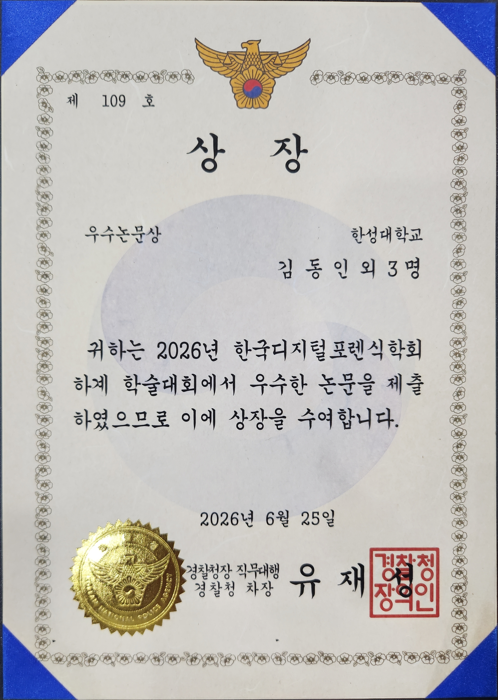
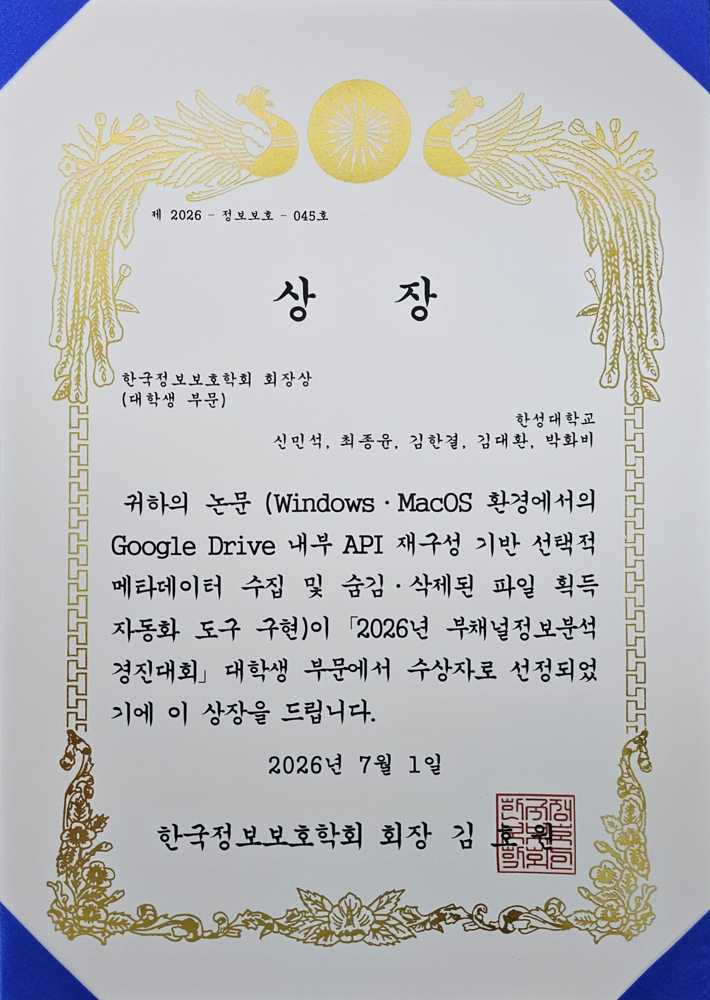
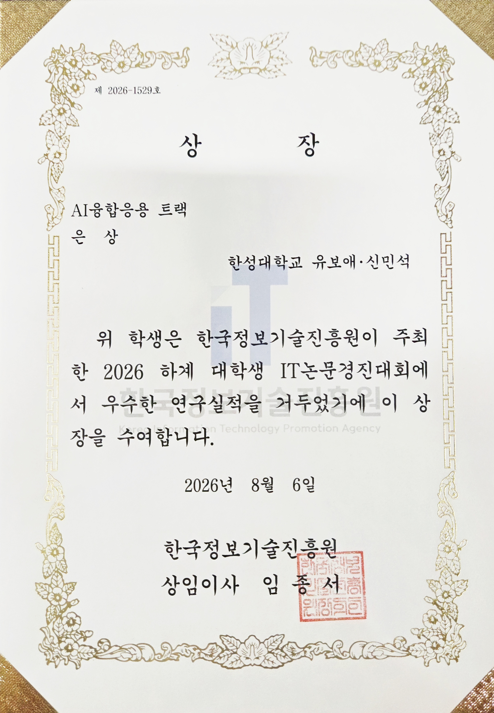
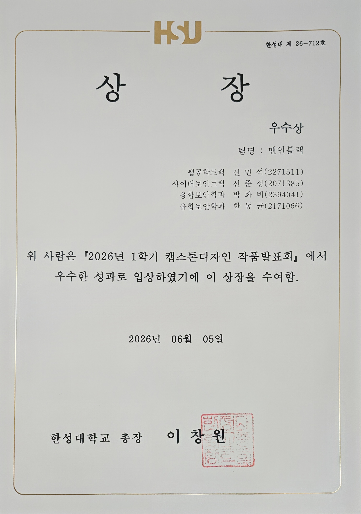
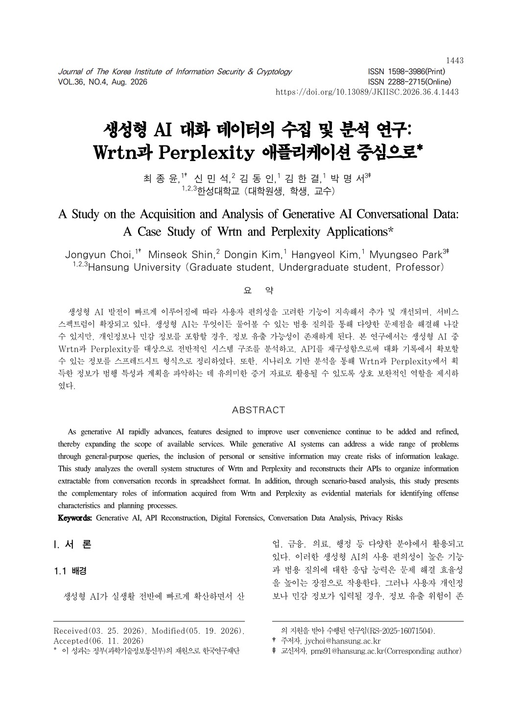
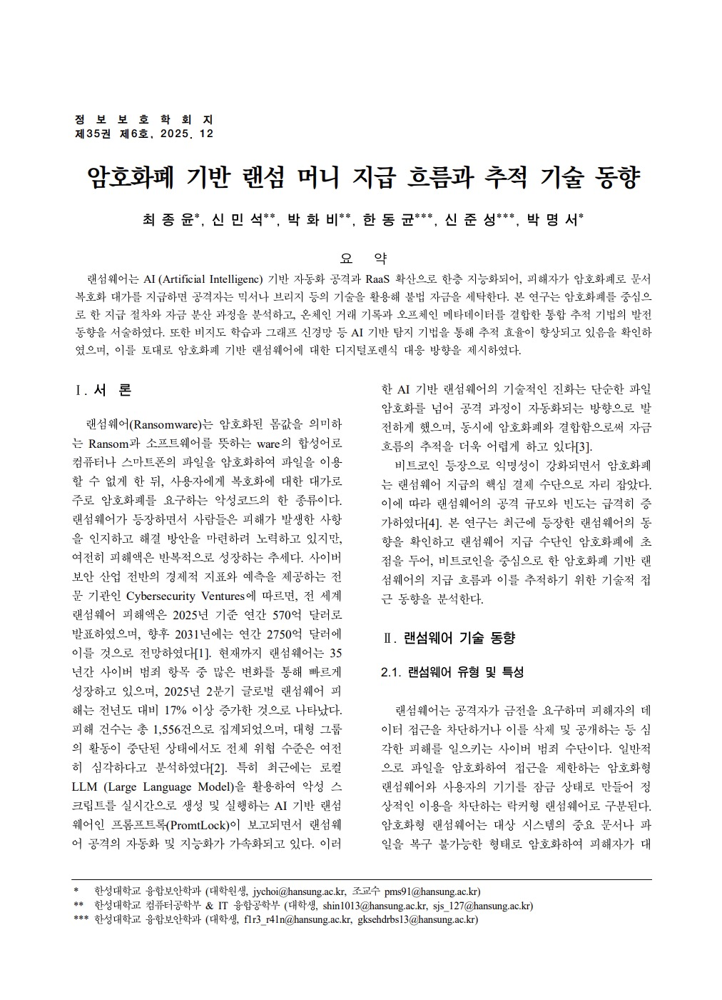
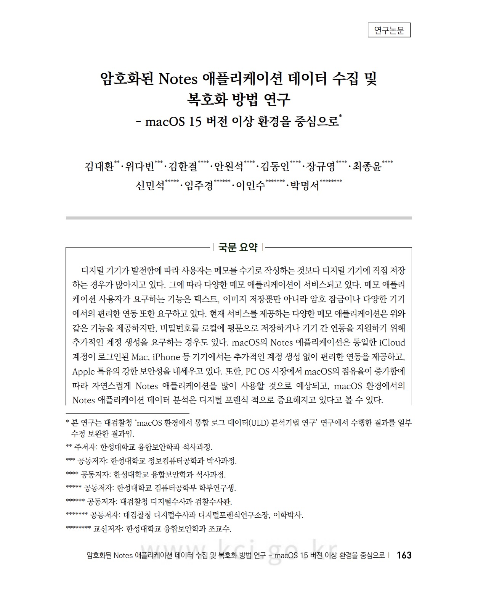
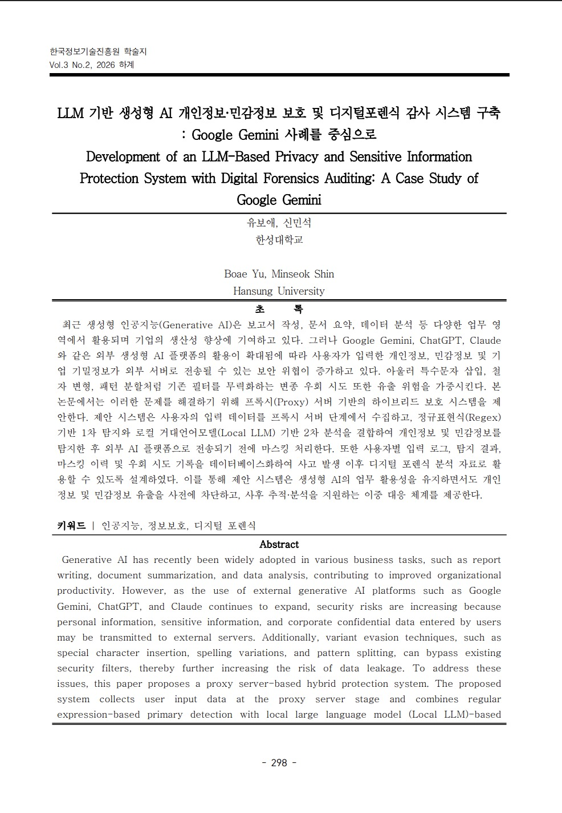

# MINSEOK SHIN

### Digital Forensics · Security Research

**한성대학교 학사 졸업**
한성대학교 컴퓨터공학부&융합보안학과(**Bachelor's Degree in Computer Engineering & Convergence Security**)

**한성대학교 석사 과정**
한성대학교 융합보안학과 융합보안(**Master's Student in Convergence Security**)

---

## [ PROFILE ]

안녕하세요. 한성대학교 융합보안학과에 재학 중인 신민석입니다.

저는 **디지털 포렌식, 클라우드 포렌식, 애플리케이션 분석, 리버스 엔지니어링, 랜섬웨어 분석, 보안 자동화** 분야에 관심을 가지고 공부하고 있습니다.

학부연구원으로 활동하며 드론 조종기 포렌식, 정보은닉 애플리케이션 암호해제, 클라우드 환경 데이터 획득 및 분석, macOS 통합 로그 분석, 애플리케이션 네트워크 취약점 자동 탐지 등 다양한 연구과제에 참여하였습니다.

이러한 경험을 바탕으로 단순한 이론 학습을 넘어 실제 환경에서 발생하는 보안 문제를 분석하고, 디지털 증거를 수집·검증하며, 포렌식 분석 절차를 자동화하는 역량을 키워가고 있습니다.

---

## [ RESEARCH PROJECTS ]

학부연구원으로 활동하며 정부·공공기관 관련 디지털 포렌식 및 보안 연구과제에 참여하였습니다.

암호화 애플리케이션 분석, 클라우드 API 재구성, macOS, 드론, 네트워크 등 다양한 환경에서 디지털 증거를 식별·수집·분석하고, 분석 절차와 기술의 적용 가능성을 검토하였습니다.

<table>
<thead>
<tr>
<th width="30%" align="center" valign="middle">연구과제</th>
<th width="18%" align="center" valign="middle">수행기관</th>
<th width="52%" align="center" valign="middle">주요 수행 내용</th>
</tr>
</thead>

<tbody>

<tr>
<td align="center" valign="middle">
<strong>정보은닉 앱 암호해제 기술 연구개발</strong>
  
<code>애플리케이션 분석</code>
<code>암호화 데이터 분석</code>
</td>

<td align="center" valign="middle">
경찰청
</td>

<td align="center" valign="middle">
정보은닉 애플리케이션의 내부 저장 구조와 암·복호화 로직을 분석하고, 암호화 데이터의 식별 및 포렌식 관점에서의 복원 가능성을 검토
</td>
</tr>

<tr>
<td align="center" valign="middle">
<strong>클라우드 데이터 획득·분석 절차 연구</strong>
  
<code>클라우드 포렌식</code>
<code>데이터 획득 자동화</code>
</td>

<td align="center" valign="middle">
대검찰청
</td>

<td align="center" valign="middle">
클라우드 환경의 데이터 획득 기술과 분석 절차를 검토하고, 데이터 획득의 신뢰성, 선별 수집 가능성 및 수사 절차 적용 가능성을 연구
</td>
</tr>

<tr>
<td align="center" valign="middle">
<strong>macOS 통합 로그 데이터 분석기법 연구</strong>
  
<code>macOS 포렌식</code>
<code>통합 로그 분석</code>
</td>

<td align="center" valign="middle">
대검찰청
</td>

<td align="center" valign="middle">
macOS 통합 로그 데이터를 분석하여 사용자 행위, 시스템 동작, 애플리케이션 실행 흔적 및 보안 이벤트를 식별하는 분석기법 연구에 참여
</td>
</tr>

<tr>
<td align="center" valign="middle">
<strong>드론 조종기 포렌식 분석 방법론 개발</strong>
  
<code>드론 포렌식</code>
<code>디지털 포렌식</code>
</td>

<td align="center" valign="middle">
한국원자력연구원
</td>

<td align="center" valign="middle">
드론 조종기와 관련 장치에서 생성되는 디지털 증거를 분석하고, 사용자 행위 흔적과 장치 사용 기록을 식별하기 위한 포렌식 분석 방법론 개발에 참여
</td>
</tr>

<tr>
<td align="center" valign="middle">
<strong>애플리케이션 네트워크 취약점 자동 탐지 기술 개발</strong>
  
<code>애플리케이션 보안</code>
<code>네트워크 취약점 분석</code>
</td>

<td align="center" valign="middle">
한국연구재단
</td>

<td align="center" valign="middle">
애플리케이션의 네트워크 요청 구조와 통신 흐름을 분석하고, 취약 가능 지점을 식별하여 네트워크 취약점 탐지 절차의 자동화 방향을 검토
</td>
</tr>

</tbody>
</table>

## [ LEADERSHIP & ACTIVITIES ]

### DEAT — Digital Forensics & Security Research Club

**DEAT**는 한성대학교 정보보안 분야 동아리로, **디지털 포렌식, 리버스 엔지니어링, 악성코드 분석, 랜섬웨어 분석, 애플리케이션 분석 및 보안 연구**를 중심으로 실습 기반 학습과 연구 활동을 수행하는 동아리입니다.

|     기간    |    직책   |
| :-------: | :-----: |
| 2026년 1학기 |  **회장** |
| 2025년 2학기 | **부회장** |

동아리 운영진으로 활동하며 보안 분야에 관심 있는 학생들이 실무 중심의 분석 경험을 쌓을 수 있도록 스터디, 실습 과제, 프로젝트 활동 및 학술대회 참여를 기획하고 지원하고 있습니다.

### Core Activities

* 애플리케이션 분석
* 악성코드 분석
* 랜섬웨어 분석
* 디지털 포렌식 연구
* 리버스 엔지니어링
* 보안 연구 및 학술대회 참여

### Responsibilities

* 동아리 운영 및 활동 기획
* 보안 실습 과제 구성
* 동아리원 학습 방향 지원
* 디지털 포렌식 및 악성코드 분석 관련 스터디 운영
* 학술대회 및 연구 활동 참여 독려

---

## [ HONORS & AWARDS ]

> 아래 수상 내역은 학술대회 및 교내 경진대회 공식 상장을 기준으로 작성하였습니다.

### External Awards

---

### 01. 경찰청장상

**학술대회:** 2026년 (사)한국디지털포렌식학회 하계학술대회 
**논문명:** 스마트홈 로봇청소기 아티팩트 분석 연구: Ecovacs를 중심으로 
**저자:** 김동인, **신민석**, 김한결, 박명서 
**역할:** 공동저자 
**수상 내용:** Ecovacs Deebot T10 Omni 로봇청소기를 대상으로 모바일 애플리케이션 내부 데이터와 클라우드 API 통신 구조를 분석하고, 사용자 계정 및 기기 식별 정보, 애플리케이션 실행 기록, 청소 이력, 지도 데이터, 청소 결과 이미지와 사진·동영상 등의 주요 포렌식 아티팩트 획득 방안을 제시하였습니다. 또한 획득한 데이터가 사건 발생 전후의 기기 동작 여부, 사용자 계정과 기기의 연결 관계, 주거 내부 구조 및 관찰 정황을 확인하는 수사 자료로 활용될 수 있음을 제시한 연구의 우수성과 실무적 활용 가능성을 인정받아 경찰청장상을 수상하였습니다. 
**수상일:** 2026-[상장 기재일] 

 

---

### 02. 한국전자통신연구원장상

**학술대회:** 2025 한국정보보호학회 충청지부 학술대회 
**논문명:** 그룹웨어 포렌식 기법 연구: Hiworks–DaouOffice 사례 
**저자:** **신민석**, 최종윤, 장규영, 김한결, 김동인, 박명서 
**역할:** 주저자 
**수상 내용:** Hiworks와 DaouOffice 협업 도구를 대상으로 그룹웨어 환경에서 생성되는 사용자 행위 로그, 업무 데이터, 접속 기록 등 주요 포렌식 아티팩트를 분석하고, 조직 내부 데이터 조사 및 압수수색 상황에서 활용 가능한 포렌식 분석 기법을 제시한 연구로 수상하였습니다. 
**수상일:** 2025-09-30 

 

---

### 03. 우수논문상

**학술대회:** 2025 제6회 호남사이버보안 컨퍼런스 추계학술대회 
**논문명:** 생성형 AI 기반 Perplexity 대화 데이터 획득 방안 연구 
**저자:** **신민석**, 최종윤, 김한결, 위다빈, 박명서 
**역할:** 주저자 
**수상 내용:** 생성형 AI 서비스인 Perplexity에서 사용자의 대화 데이터와 관련 기록을 포렌식 관점에서 획득하기 위한 방법을 연구하였으며, 웹 서비스 기반 AI 대화 기록의 수집 가능성과 분석 절차를 제시한 점을 인정받아 수상하였습니다. 
**수상일:** 2025-09-18 

 

---

### 04. 은상 · 한국포렌식학회장상

**대회:** 2025 제2회 한국포렌식학회 논문경진대회 
**논문명:** 조직 내부 데이터 압수수색을 위한 그룹웨어 포렌식 기술 연구: DaouOffice를 중심으로 
**저자:** **신민석**, 김동인, 장규영, 최종윤, 박명서 
**역할:** 주저자 
**수상 내용:** DaouOffice를 중심으로 조직 내부 협업 환경에서 발생하는 업무 데이터, 사용자 활동 기록, 접속 흔적 등을 분석하고, 수사 및 압수수색 과정에서 필요한 그룹웨어 포렌식 데이터 식별 및 수집 방안을 제시한 연구로 은상을 수상하였습니다. 
**수상일:** 2025-09-23 

 

---

### 05. 한국정보보호학회장상

**대회:** 제9회 부채널정보분석경진대회 
**논문명:** Windows/macOS 환경에서의 Google Drive 내부 API 재구성 기반 선택적 메타데이터 수집 및 숨김·삭제된 파일 획득 자동화 도구 구현 
**저자:** **신민석**, 최종윤, 김한결, 김대환, 박화비, 박명서 
**역할:** 주저자 
**수상 내용:** Google Drive 웹 환경에서 발생하는 내부 API 요청 구조를 분석하고 이를 재구성하여, 클라우드 압수수색 과정에서 사건 관련성이 높은 데이터를 선택적으로 수집할 수 있는 자동화 도구를 구현하였습니다. SearchItems 요청과 continuation_token 기반 반복 수집 방식을 활용해 3,216개의 파일 및 폴더 데이터를 수집하였으며, File ID를 기반으로 파일명, 상위 폴더 ID, 생성·수정·열람 시각, 공유 여부, 소유자 정보, 휴지통 여부 및 파일 접근 URL 등의 주요 메타데이터를 획득하였습니다. 또한 숨겨진 작업 공간과 휴지통으로 이동된 파일의 메타데이터 수집, 다중 로그인 환경에서의 계정별 데이터 분리 수집, JSON·TXT·Excel 형식의 결과 저장 기능을 구현한 연구의 기술적 완성도와 클라우드 포렌식 분야의 활용 가능성을 인정받아 한국정보보호학회장상을 수상하였습니다. 
**수상일:** 2026-07-01 

 

---

### 06. 우수논문상 · 한국방송통신전파진흥원장상

**학술대회:** 2025 제6회 호남사이버보안 컨퍼런스 
**논문명:** Wrtn API 재구성에 기반한 생성형 AI 대화 기록물 포렌식 수집과 재현성 검증 
**저자:** 최종윤, **신민석**, 김동인, 김한결, 박명서 
**역할:** 공동저자 
**수상 내용:** 생성형 AI 서비스 Wrtn의 API 요청 구조를 분석하고 재구성하여 AI 대화 기록물을 포렌식 관점에서 수집하는 방법을 제시하였으며, 수집 결과의 재현성 검증을 통해 디지털 증거로서의 활용 가능성을 다룬 연구로 수상하였습니다. 
**수상일:** 2025-09-18 

 

---

### 07. 우수논문상 · 정보보호학회장상

**학술대회:** 2025년도 한국정보보호학회 동계학술대회 
**논문명:** CLOVA Note API 기반 음성 포렌식 및 발화 분석 연구 
**저자:** 최종윤, **신민석**, 김한결, 위다빈, 박명서 
**역할:** 공동저자 
**수상 내용:** CLOVA Note 서비스의 API 기반 데이터 구조를 분석하여 음성 기록과 발화 데이터를 포렌식 관점에서 수집·분석하는 방안을 연구하였으며, 음성 기반 서비스에서의 발화 재구성 및 증거 활용 가능성을 제시한 연구로 수상하였습니다. 
**수상일:** 2025-11-27 

 

---

### 08. 한국정보기술진흥원 2026 하계 대학생 IT논문경진대회 우수논문상

**대회:** 2026 하계 대학생 IT논문경진대회 
**논문명:** LLM 기반 생성형 AI 개인정보 민감정보 보호 및 디지털포렌식 감사 시스템 구축: Google Gemini 사례를 중심으로 
**저자:** 유보애, **신민석** 
**역할:** 제2저자 
**수상 내용:** Google Gemini를 중심으로 생성형 AI 서비스 이용 과정에서 개인정보 및 민감정보가 외부 AI 서비스로 전달될 수 있는 문제를 분석하고, LLM 기반 개인정보·민감정보 탐지 및 보호 기능과 포렌식 감사 기능을 결합한 시스템을 구축하였습니다. 사용자 입력 데이터에서 민감정보를 식별하고 보호한 뒤 AI 서비스와 연계하며, 처리 과정과 결과를 감사 가능한 형태로 기록하여 생성형 AI 활용 환경에서 개인정보 보호와 포렌식 관점에서 사용자의 로그를 획득하는 방안을 제시한 연구로 우수논문상을 수상하였습니다. 

 

---

### University Awards

---

### 09. 최우수상 · 논문 부문

**대회:** 제21회 한성공학경진대회 
**논문명:** 기술 유출 및 겸직·겹업 위반 대응을 위한 Hiworks 협업 도구 로그 분석 자동화 툴 개발 
**팀원:** **신민석**, 김대환 
**역할:** 팀장 
**수상 내용:** Hiworks 협업 도구에서 생성되는 로그와 사용자 행위 데이터를 분석하여 기술 유출, 겸직·겹업 위반 등 조직 내부 보안 이슈에 대응할 수 있는 로그 분석 자동화 도구를 개발하였으며, 포렌식 분석 절차의 자동화 가능성을 제시한 성과로 최우수상을 수상하였습니다. 
**수상일:** 2025-09-26 

 

---

### 10. 대상 · 아이디어 부문

**대회:** 2025 창의융합역량 경진대회 
**프로젝트:** 생체 인식 기반 미래형 AI–블록체인 응급환자 골든타임 확보 시스템 
**팀명:** 메디슨 
**팀원:** 김건우, **신민석**, 양다원, 정윤녕, 조수빈 
**역할:** 팀원 
**수상 내용:** 응급환자 발생 시 생체 인식, AI 분석, 블록체인 기반 신뢰성 확보 기술을 결합하여 환자 식별과 응급 정보 전달을 지원하는 아이디어를 제안하였으며, 응급의료 환경에서 골든타임 확보 가능성을 제시한 점을 인정받아 대상을 수상하였습니다. 
**수상일:** 2025-08-13 

 

---

### 11. 우수상

**대회:** 2025 한성 SW중심대학 페스티벌 
**프로젝트:** 생성형 AI 프록시 서버 기반 개인정보 및 민감정보 마스킹 시스템 
**팀명:** B-1 
**팀원:** **신민석**, 유보애 
**역할:** 팀장 
**수상 내용:** Google Gemini와 같은 생성형 AI 서비스 이용 과정에서 개인정보와 민감정보가 외부 API로 직접 전달될 수 있는 문제를 해결하기 위해, 프록시 서버 기반의 개인정보 및 민감정보 마스킹 시스템을 구축하였습니다. 사용자의 입력 데이터가 AI 모델로 전송되기 전에 이름, 연락처, 계정 정보 등 민감 요소를 탐지하고 마스킹함으로써 생성형 AI 활용 환경에서의 데이터 보호 가능성을 제시한 성과로 우수상을 수상하였습니다. 
**수상일:** 2025-11-28 

 

---

### 12. 동상 · 아이디어 부문

**대회:** 2024학년도 2학기 제11회 창의융합역량 경진대회 
**프로젝트:** AI-Powered Drone Navigator & Delivery 
**팀명:** 거북선 
**팀원:** **신민석**, 박준환, 심승보, 이준, 박계령, 양다원 
**역할:** 팀장 
**수상 내용:** AI 기반 드론 항법 및 배송 시스템 아이디어를 제안하고, 드론 운용 환경에서의 경로 탐색, 배송 자동화, 활용 가능성을 중심으로 프로젝트를 기획하였습니다. 팀장으로서 아이디어 구체화와 발표를 주도한 성과로 동상을 수상하였습니다. 
**수상일:** 2025-02-10 

 

---

### 13. 우수상

**대회:** 2026 융합보안 캡스톤 디자인 
**프로젝트:** LLM 기반 다크웹 도메인 분석 및 위험도 평가 시스템 
**팀명:** 맨인블랙 
**팀원:** **신민석**, 한동균, 신준성, 박화비 
**역할:** 팀장 
**수상 내용:** 다크웹 도메인을 대상으로 접근성, 검색 색인 여부, 사이트 유형, 범죄 카테고리 등을 분석하고, LLM 기반 텍스트 분석을 통해 도메인의 위험도를 평가하는 시스템을 구축하였습니다. 단순 키워드 기반 탐지를 넘어 다크웹 사이트의 수집 데이터와 분석 결과를 바탕으로 적법 사이트와 고위험 사이트를 구분하고, 보안 분석 및 수사 지원 관점에서 활용 가능한 위험도 평가 체계를 제시한 성과로 우수상을 수상하였습니다. 
**수상일:** 2026-06-05 

 

---

## [ JOURNAL PUBLICATIONS ]

> 저자 순서는 공식 게재 기록을 기준으로 작성하였습니다.

### 01. 생성형 AI 대화 데이터의 수집 및 분석 연구: Wrtn과 Perplexity 애플리케이션 중심으로

<table style="border:0; border-collapse:collapse; width:100%;">
<tr>
<td width="46%" align="center" valign="middle" style="border:0; padding:12px 24px 12px 0;">

</td>
<td width="54%" align="center" valign="middle" style="border:0; padding:12px 0 12px 24px;">

<table style="margin:auto;">
<tr>
<td><strong>저자</strong></td>
<td>최종윤, <strong>신민석</strong>, 김동인, 김한결, 박명서</td>
</tr>
<tr>
<td><strong>학술지</strong></td>
<td>정보보호학회논문지</td>
</tr>
<tr>
<td><strong>발행기관</strong></td>
<td>한국정보보호학회</td>
</tr>
<tr>
<td><strong>권호</strong></td>
<td>제36권 제4호</td>
</tr>
<tr>
<td><strong>게재연도</strong></td>
<td>2026</td>
</tr>
<tr>
<td><strong>소속</strong></td>
<td>한성대학교</td>
</tr>
<tr>
<td><strong>역할</strong></td>
<td>제2저자</td>
</tr>
<tr>
<td><strong>KCI 등재 여부</strong></td>
<td>KCI 등재</td>
</tr>
<tr>
<td><strong>링크</strong></td>
<td><a href="https://www.dbpia.co.kr/journal/articleDetail?nodeId=NODE12942138">DBpia 논문 페이지</a></td>
</tr>
</table>

</td>
</tr>
</table>

 

---

### 02. 암호화폐 기반 랜섬 머니 지급 흐름과 추적 기술 동향

<table style="border:0; border-collapse:collapse; width:100%;">
<tr>
<td width="46%" align="center" valign="middle" style="border:0; padding:12px 24px 12px 0;">

</td>
<td width="54%" align="center" valign="middle" style="border:0; padding:12px 0 12px 24px;">

<table style="margin:auto;">
<tr>
<td><strong>저자</strong></td>
<td>최종윤, <strong>신민석</strong>, 박화비, 한동균, 신준성, 박명서</td>
</tr>
<tr>
<td><strong>학술지</strong></td>
<td>정보보호학회지</td>
</tr>
<tr>
<td><strong>권호</strong></td>
<td>Vol.35, No.6</td>
</tr>
<tr>
<td><strong>페이지</strong></td>
<td>41–48</td>
</tr>
<tr>
<td><strong>게재일</strong></td>
<td>2025-12</td>
</tr>
<tr>
<td><strong>소속</strong></td>
<td>한성대학교</td>
</tr>
<tr>
<td><strong>역할</strong></td>
<td>제2저자</td>
</tr>
<tr>
<td><strong>링크</strong></td>
<td><a href="https://www.dbpia.co.kr/journal/articleDetail?nodeId=NODE12547751">DBpia 논문 페이지</a></td>
</tr>
</table>

</td>
</tr>
</table>

 

---

### 03. 암호화된 Notes 애플리케이션 데이터 수집 및 복호화 방법 연구

#### macOS 15 버전 이상 환경을 중심으로

<table style="border:0; border-collapse:collapse; width:100%;">
<tr>
<td width="46%" align="center" valign="middle" style="border:0; padding:12px 24px 12px 0;">

</td>
<td width="54%" align="center" valign="middle" style="border:0; padding:12px 0 12px 24px;">

<table style="margin:auto;">
<tr>
<td><strong>저자</strong></td>
<td>김대환, 위다빈, 김한결, 안원석, 김동인, 장규영, 최종윤, <strong>신민석</strong>, 임주경, 이인수, 박명서</td>
</tr>
<tr>
<td><strong>학술지</strong></td>
<td>법과학</td>
</tr>
<tr>
<td><strong>권호</strong></td>
<td>Vol.13, No.13</td>
</tr>
<tr>
<td><strong>페이지</strong></td>
<td>163–189</td>
</tr>
<tr>
<td><strong>게재연도</strong></td>
<td>2026</td>
</tr>
<tr>
<td><strong>발행기관</strong></td>
<td>대검찰청</td>
</tr>
<tr>
<td><strong>KCI 등재 여부</strong></td>
<td>KCI 등재후보</td>
</tr>
<tr>
<td><strong>링크</strong></td>
<td><a href="https://www.kci.go.kr/kciportal/ci/sereArticleSearch/ciSereArtiView.kci?sereArticleSearchBean.artiId=ART003331390">법과학의 신동향 논문 페이지</a></td>
</tr>
</table>

</td>
</tr>
</table>

> 본 논문은 macOS 환경에서 암호화된 Notes 애플리케이션 데이터의 수집 및 분석 방법을 다룬 연구입니다.

 

---

### 04. LLM 기반 생성형 AI 개인정보 민감정보 보호 및 디지털포렌식 감사 시스템 구축: Google Gemini 사례를 중심으로

<table style="border:0; border-collapse:collapse; width:100%;">
<tr>
<td width="46%" align="center" valign="middle" style="border:0; padding:12px 24px 12px 0;">

</td>
<td width="54%" align="center" valign="middle" style="border:0; padding:12px 0 12px 24px;">

<table style="margin:auto;">
<tr>
<td><strong>저자</strong></td>
<td>유보애, <strong>신민석</strong></td>
</tr>
<tr>
<td><strong>학술지</strong></td>
<td>한국정보기술진흥원 학술지</td>
</tr>
<tr>
<td><strong>발행기관</strong></td>
<td>한국정보기술진흥원</td>
</tr>
<tr>
<td><strong>권호</strong></td>
<td>제3권 제2호</td>
</tr>
<tr>
<td><strong>게재연도</strong></td>
<td>2026</td>
</tr>
<tr>
<td><strong>소속</strong></td>
<td>한성대학교</td>
</tr>
<tr>
<td><strong>역할</strong></td>
<td>제2저자</td>
</tr>
<tr>
<td><strong>링크</strong></td>
<td><a href="https://www.dbpia.co.kr/journal/articleDetail?nodeId=NODE12936356">DBpia 논문 페이지</a></td>
</tr>
</table>

</td>
</tr>
</table>

 

---

## [ CONFERENCE PUBLICATIONS ]

> 학술대회 발표 이력은 발표 연도를 기준으로 정리하였으며, 저자 순서는 공식 학술대회 기록을 따릅니다.

### Publication Summary

|      구분      |    건수   |
| :----------: | :-----: |
|  2026년 발표 논문 |  **4건** |
|  2025년 발표 논문 |  **9건** |
| **전체 발표 논문** | **13건** |
|  **주저자 발표**  |  **6건** |
|    공동저자 발표   |  **7건** |

---

### 2026

| 학술대회                                  | 논문명                                                                                      | 저자                               |    역할   |       수상       |
| ------------------------------------- | ---------------------------------------------------------------------------------------- | -------------------------------- | :-----: | :------------: |
| **KDFS 2026** (사)한국디지털포렌식학회 하계학술대회 | **스마트홈 로봇청소기 아티팩트 분석 연구: Ecovacs를 중심으로**                                                 | 김동인, **신민석**, 박명서                |   공동저자  |    **경찰청장상**   |
| **CISC-S 2026** 한국정보보호학회 하계학술대회    | **Google Drive 서비스의 API 재구성 기반 선택적 데이터 수집 및 숨김·삭제 파일 메타데이터 획득 연구**                       | **신민석**, 최종윤, 김한결, 김대환, 박명서      | **주저자** |        -       |
| **제9회 부채널정보분석경진대회**                   | **Windows/macOS 환경에서의 Google Drive 내부 API 재구성 기반 선택적 메타데이터 수집 및 숨김·삭제된 파일 획득 자동화 도구 구현** | **신민석**, 최종윤, 김한결, 김대환, 박화비, 박명서 | **주저자** | **한국정보보호학회장상** |
| **CISC-S 2026** 한국정보보호학회 하계학술대회    | **상담 음성 기반 프로파일 화자 분리 및 발화 재구성 연구**                                                      | 최종윤, **신민석**, 김대환, 김한결, 박명서      |   공동저자  |        -       |

---

### 2025

| 학술대회                                   | 논문명                                                     | 저자                               |    역할   |         수상        |
| -------------------------------------- | ------------------------------------------------------- | -------------------------------- | :-----: | :---------------: |
| **CISC-S 2025** 한국정보보호학회 하계학술대회     | **겸직·겹업 위반 대응을 위한 Hiworks 협업 도구 로그 분석 자동화 툴 개발**        | **신민석**, 위다빈, 박명서                | **주저자** |         -         |
| **CISC-S 2025** 한국정보보호학회 하계학술대회     | **폴라리스 오피스 대상의 클라우드 포렌식 기술 연구**                         | 위다빈, 김한결, 안원석, **신민석**, 박명서      |   공동저자  |         -         |
| **HONAM 2025** 제6회 호남사이버보안 컨퍼런스     | **생성형 AI 기반 Perplexity 대화 데이터 획득 방안 연구**                | **신민석**, 최종윤, 김한결, 위다빈, 박명서      | **주저자** |     **우수논문상**     |
| **HONAM 2025** 제6회 호남사이버보안 컨퍼런스     | **Wrtn API 재구성에 기반한 생성형 AI 대화·기록물 포렌식 수집과 재현성 검증**      | 최종윤, **신민석**, 김동인, 김한결, 박명서      |   공동저자  | **한국방송통신전파진흥원장상** |
| **KIISCCC 2025** 한국정보보호학회 충청지부 학술대회 | **그룹웨어 포렌식 기법 연구: Hiworks·DaouOffice 사례**               | **신민석**, 최종윤, 장규영, 김한결, 김동인, 박명서 | **주저자** |  **한국전자통신연구원장상**  |
| **KAF 2025** 한국포렌식학회 논문경진대회         | **조직 내부 데이터 압수수색을 위한 그룹웨어 포렌식 기술 연구: DaouOffice를 중심으로** | **신민석**, 김동인, 장규영, 최종윤, 박명서      | **주저자** |  **은상·한국포렌식학회장상** |
| **CISC-W 2025** 한국정보보호학회 동계학술대회     | **오픈소스 기반 Yurei 랜섬웨어에 대한 동적 분석 및 연관성 식별 연구**            | 김한결, 위다빈, 최종윤, **신민석**, 박명서      |   공동저자  |         -         |
| **CISC-W 2025** 한국정보보호학회 동계학술대회     | **차량용 인포테인먼트 기반 사용자 행위 추적**                             | 김대환, **신민석**, 장규영, 안원석, 박명서      |   공동저자  |         -         |
| **CISC-W 2025** 한국정보보호학회 동계학술대회     | **CLOVA Note API 기반 음성 포렌식 및 발화 분석 연구**                 | 최종윤, **신민석**, 김한결, 위다빈, 박명서      |   공동저자  |    **정보보호학회장상**   |

---

## [ TECHNICAL INTERESTS ]

`Digital Forensics` · `Cloud Forensics` · `macOS Forensics`
`Application Forensics` · `Reverse Engineering` · `Malware Analysis`
`Ransomware Analysis` · `Network Traffic Analysis` · `Security Automation`
`Forensic Tool Development`

---

## [ CURRENT RESEARCH ]

현재는 디지털 포렌식, 클라우드 보안, 애플리케이션 분석 및 포렌식 자동화 분야의 실무 역량을 강화하는 데 집중하고 있습니다.

특히 **클라우드 데이터 획득, 내부 API 재구성, 암호화 애플리케이션 데이터 분석, macOS 아티팩트 분석 및 보안 도구 개발**과 관련된 연구를 지속적으로 수행하고 있습니다.

---

## [ STATUS ]

**Researching · Building · Recovering**
